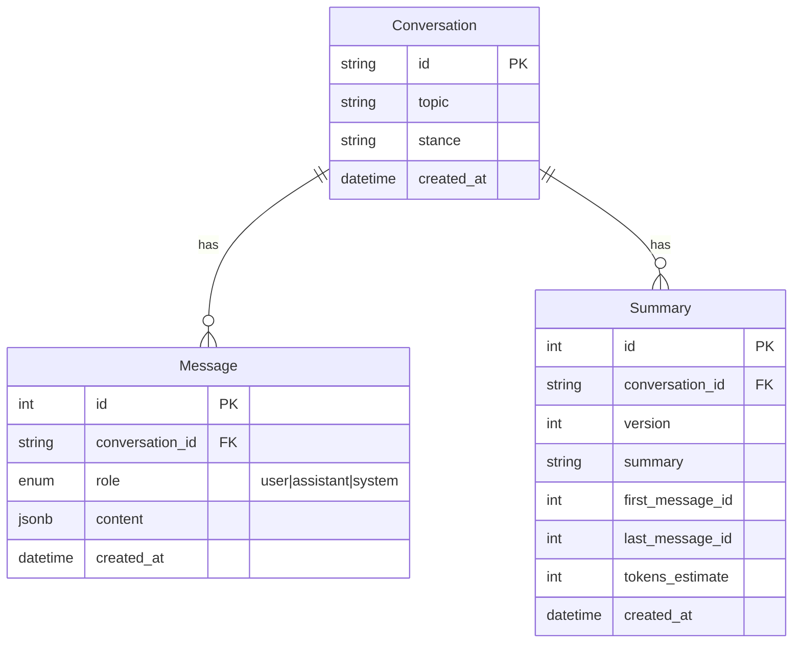
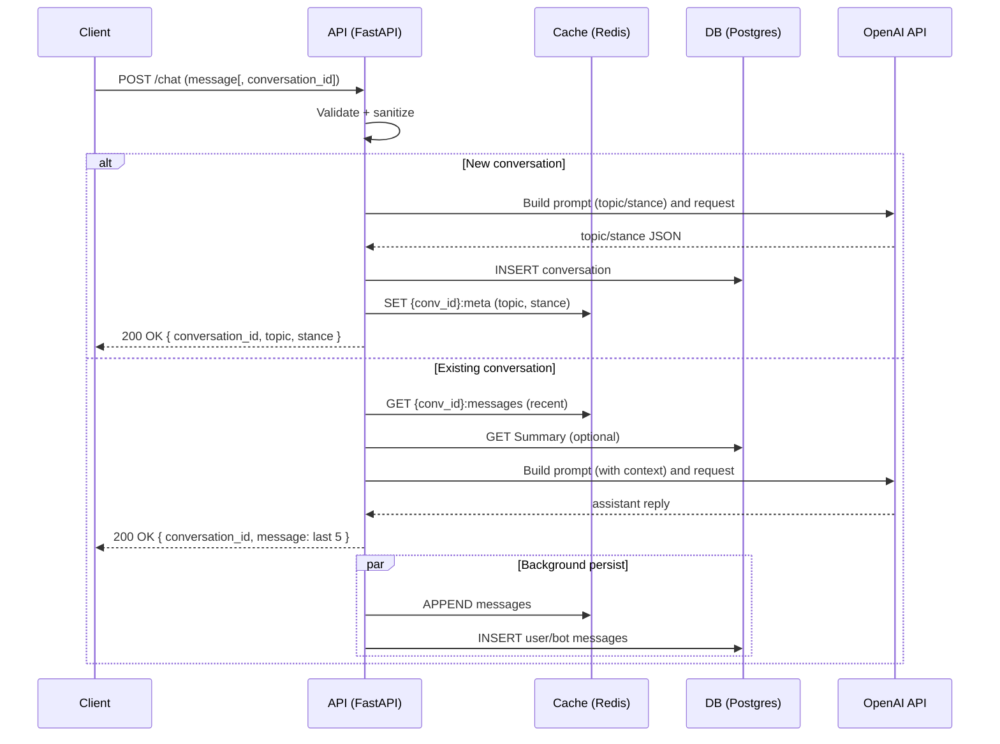

# CARAX — Debate Chatbot API

Carax is a FastAPI-based service for hosting a debate-oriented chatbot. The bot holds a coherent stance for a topic, argues persuasively across multiple turns, and keeps a short-term memory to maintain context.

- Tech: FastAPI, SQLModel, PostgreSQL, Redis, Docker/Compose, OpenAI API.
- Public chat endpoint: https://trusting-shrew-blindly.ngrok-free.app/chat
- Author info endpoint: `GET /author` (protected with API key).

Note: The goal is to stand the ground on the initial topic/stance and be persuasive across 5+ messages. Responses target ≤ 30 seconds.

## Quick Start

Requirements:
- Docker + Docker Compose
- Make

Run the service:
1) make run
2) make setup

After step 2 the API is ready to receive requests.

## Environment

Copy `.env.example` to `.env` and fill in your values:
- `API_KEY`: Required Bearer token for protected endpoints.
- `OPENAI_API_KEY`: Required to talk to the OpenAI API.
- `DB_ASYNC_CONNECTION_STR`, `REDIS_URL`: Use the defaults to talk to Compose services.

## Make Targets

- `make`: Show the most useful commands.
- `make install`: Check tools, install Python deps.
- `make run`: Build + start all services in Docker.
- `make setup`: Initialize database schema.
- `make test`: Run tests.
- `make down`: Stop all services.
- `make clean`: Remove containers and volumes.

## API

Auth header: send `Authorization: Bearer <API_KEY>`. For now, use `prod-kopi-api-key` as the token value.

- `POST /chat` — debate turn
  Request body:
  - First message (new conversation): `{ "message": "Text defining topic and stance" }`
  - Subsequent messages: `{ "conversation_id": "id", "message": "Text" }`

  Response body:
  - New conversation: `{ "conversation_id": "id", "topic": "...", "stance": "..." }`
  - Existing conversation: `{ "conversation_id": "id", "message": [ {"role": "user"|"bot", "message": "..."}, ... ] }` (last 5 entries)

- `GET /author` — author metadata

Example cURL:
```
curl -X POST \
  -H "Authorization: Bearer prod-kopi-api-key" \
  -H "Content-Type: application/json" \
  -d '{"message": "Debate about climate change. You argue it is not real."}' \
  http://localhost:8000/chat
```

## Database Schema

The relational schema (PostgreSQL) models conversations, messages, and rolling summaries.



## Request Flow (Timing)

Sequence of a typical `/chat` request.



## Public URL

When running with Docker Compose, an `ngrok` container exposes the API publicly:
- `POST https://trusting-shrew-blindly.ngrok-free.app/chat`

## Notes

- Responses aim to be persuasive and consistent with the initial stance.
- Short-term memory is cached for efficiency; background tasks persist turns.
- Tests mock external services; a real OpenAI key is not required to run tests.
